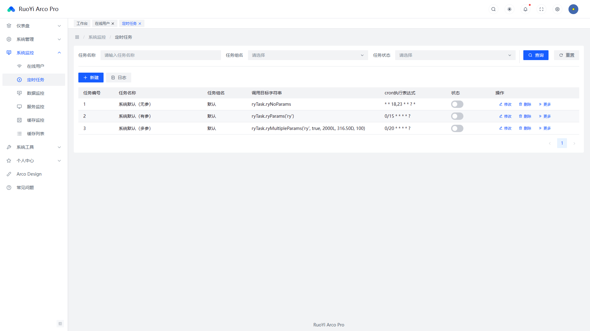
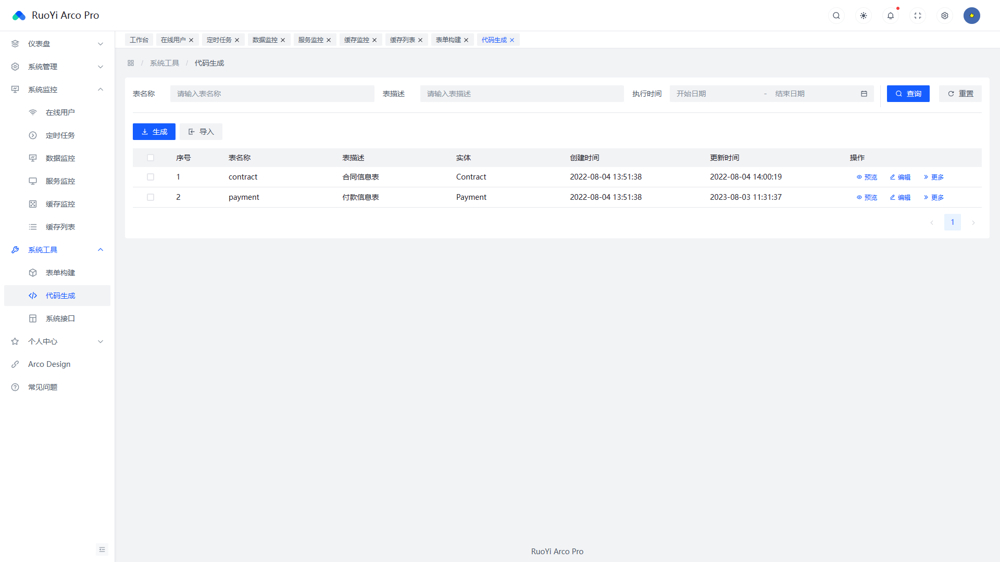

<p align="center" style="
    display: flex;
    justify-content: center;
    align-items: center;
">
	
    <span> + </span>
    
</p>
<h1 align="center" style="margin: 30px 0 30px; font-weight: bold;">RuoYi v3.8.9</h1>
<h4 align="center">基于SpringBoot3+Vue3+Ts前后端分离的Java快速开发框架</h4>
<p align="center">
	<a href="https://gitee.com/y_project/RuoYi-Vue/stargazers"></a>
	<a href="https://gitee.com/y_project/RuoYi-Vue"></a>
	<a href="https://gitee.com/y_project/RuoYi-Vue/blob/master/LICENSE"></a>
</p>


## 平台简介

若依是一套全部开源的快速开发平台，毫无保留给个人及企业免费使用。

* 前端采用Vue3、TypeScript、Arco Design Vue。
* 后端采用JDK17、Spring Boot3、Spring Security、Redis & Jwt 、Mybatis-plus。
* 权限认证使用Jwt，支持多终端认证系统。
* 支持加载动态权限菜单，多方式轻松权限控制。
* 高效率开发，使用代码生成器可以一键生成前后端代码。&nbsp;&nbsp;

## 内置功能

1.  用户管理：用户是系统操作者，该功能主要完成系统用户配置。
2.  部门管理：配置系统组织机构（公司、部门、小组），树结构展现支持数据权限。
3.  岗位管理：配置系统用户所属担任职务。
4.  菜单管理：配置系统菜单，操作权限，按钮权限标识等。
5.  角色管理：角色菜单权限分配、设置角色按机构进行数据范围权限划分。
6.  字典管理：对系统中经常使用的一些较为固定的数据进行维护。
7.  参数管理：对系统动态配置常用参数。
8.  通知公告：系统通知公告信息发布维护。
9.  操作日志：系统正常操作日志记录和查询；系统异常信息日志记录和查询。
10. 登录日志：系统登录日志记录查询包含登录异常。
11. 在线用户：当前系统中活跃用户状态监控。
12. 定时任务：在线（添加、修改、删除)任务调度包含执行结果日志。
13. 代码生成：前后端代码的生成（java、html、xml、sql）支持CRUD下载 。
14. 系统接口：根据业务代码自动生成相关的api接口文档。
15. 服务监控：监视当前系统CPU、内存、磁盘、堆栈等相关信息。
16. 缓存监控：对系统的缓存信息查询，命令统计等。
17.  ~~在线构建器：拖动表单元素生成相应的HTML代码。~~
18. 连接池监视：监视当前系统数据库连接池状态，可进行分析SQL找出系统性能瓶颈。

- ## 开始使用

  1. 环境准备

     * 运行启动RuoYi-Vue，参考[RuoYi文档](https://doc.ruoyi.vip/ruoyi-vue/)
     * 安装[node](http://nodejs.org/)和[git](https://git-scm.com/)

  2. 安装

     ```shell
     git clone https://github.com/XXGxiaoyu/Ruoyi-ArcoDesignPro.git
     ```

  3. 本地开发

     进入项目根目录

     ```shell
     pnpm i
     ```


     ```shell
  pnpm dev
     ```

     > 打开浏览器访问 [http://localhost:8991](http://localhost:8991/)

## 演示图

<table>
    <tr>
        <td></td>
        <td></td>
    </tr>
    <tr>
        <td></td>
        <td></td>
    </tr>
    <tr>
        <td></td>
        <td></td>
    </tr>
    <tr>
        <td></td>
        <td></td>
    </tr>
    <tr>
        <td></td>
        <td></td>
    </tr>
    <tr>
        <td></td>
        <td></td>
    </tr>
    <tr>
        <td></td>
        <td></td>
    </tr>
    <tr>
        <td></td>
        <td></td>
    </tr>
    <tr>
        <td></td>
        <td></td>
    </tr>
    <tr>
        <td></td>
        <td></td>
    </tr>
    <tr>
        <td></td>
        <td></td>
    </tr>
</table>


## 若依前后端分离交流群

QQ群： [](https://jq.qq.com/?_wv=1027&k=5bVB1og) [](https://jq.qq.com/?_wv=1027&k=5eiA4DH) [](https://jq.qq.com/?_wv=1027&k=5AxMKlC) [](https://jq.qq.com/?_wv=1027&k=51G72yr) [](https://jq.qq.com/?_wv=1027&k=VvjN2nvu) [](https://jq.qq.com/?_wv=1027&k=5vYAqA05) [](https://jq.qq.com/?_wv=1027&k=kOIINEb5) [](https://jq.qq.com/?_wv=1027&k=UKtX5jhs) [](https://jq.qq.com/?_wv=1027&k=EI9an8lJ) [](https://jq.qq.com/?_wv=1027&k=SWCtLnMz) [](https://jq.qq.com/?_wv=1027&k=96Dkdq0k) [](https://jq.qq.com/?_wv=1027&k=0fsNiYZt) [](https://jq.qq.com/?_wv=1027&k=7xw4xUG1) [](https://jq.qq.com/?_wv=1027&k=eCx8eyoJ) [](https://jq.qq.com/?_wv=1027&k=SpyH2875) [](https://jq.qq.com/?_wv=1027&k=tKEt51dz) [](http://qm.qq.com/cgi-bin/qm/qr?_wv=1027&k=0vBbSb0ztbBgVtn3kJS-Q4HUNYwip89G&authKey=8irq5PhutrZmWIvsUsklBxhj57l%2F1nOZqjzigkXZVoZE451GG4JHPOqW7AW6cf0T&noverify=0&group_code=143961921) [](http://qm.qq.com/cgi-bin/qm/qr?_wv=1027&k=ZFAPAbp09S2ltvwrJzp7wGlbopsc0rwi&authKey=HB2cxpxP2yspk%2Bo3WKTBfktRCccVkU26cgi5B16u0KcAYrVu7sBaE7XSEqmMdFQp&noverify=0&group_code=174951577) [](http://qm.qq.com/cgi-bin/qm/qr?_wv=1027&k=Fn2aF5IHpwsy8j6VlalNJK6qbwFLFHat&authKey=uyIT%2B97x2AXj3odyXpsSpVaPMC%2Bidw0LxG5MAtEqlrcBcWJUA%2FeS43rsF1Tg7IRJ&noverify=0&group_code=161281055) [](http://qm.qq.com/cgi-bin/qm/qr?_wv=1027&k=XIzkm_mV2xTsUtFxo63bmicYoDBA6Ifm&authKey=dDW%2F4qsmw3x9govoZY9w%2FoWAoC4wbHqGal%2BbqLzoS6VBarU8EBptIgPKN%2FviyC8j&noverify=0&group_code=138988063) [](http://qm.qq.com/cgi-bin/qm/qr?_wv=1027&k=DkugnCg68PevlycJSKSwjhFqfIgrWWwR&authKey=pR1Pa5lPIeGF%2FFtIk6d%2FGB5qFi0EdvyErtpQXULzo03zbhopBHLWcuqdpwY241R%2F&noverify=0&group_code=151450850) [](http://qm.qq.com/cgi-bin/qm/qr?_wv=1027&k=F58bgRa-Dp-rsQJThiJqIYv8t4-lWfXh&authKey=UmUs4CVG5OPA1whvsa4uSespOvyd8%2FAr9olEGaWAfdLmfKQk%2FVBp2YU3u2xXXt76&noverify=0&group_code=224622315) [](http://qm.qq.com/cgi-bin/qm/qr?_wv=1027&k=Nxb2EQ5qozWa218Wbs7zgBnjLSNk_tVT&authKey=obBKXj6SBKgrFTJZx0AqQnIYbNOvBB2kmgwWvGhzxR67RoRr84%2Bus5OadzMcdJl5&noverify=0&group_code=287842588) [](http://qm.qq.com/cgi-bin/qm/qr?_wv=1027&k=numtK1M_I4eVd2Gvg8qtbuL8JgX42qNh&authKey=giV9XWMaFZTY%2FqPlmWbkB9g3fi0Ev5CwEtT9Tgei0oUlFFCQLDp4ozWRiVIzubIm&noverify=0&group_code=187944233) [](http://qm.qq.com/cgi-bin/qm/qr?_wv=1027&k=G6r5KGCaa3pqdbUSXNIgYloyb8e0_L0D&authKey=4w8tF1eGW7%2FedWn%2FHAypQksdrML%2BDHolQSx7094Agm7Luakj9EbfPnSTxSi2T1LQ&noverify=0&group_code=228578329) 点击按钮入群。

## 该项目由以下开源项目提供支持

- [RuoYi-ArcoDesignVue(前端)](https://gitee.com/renneseme/ruoyi-arco-design-vue)